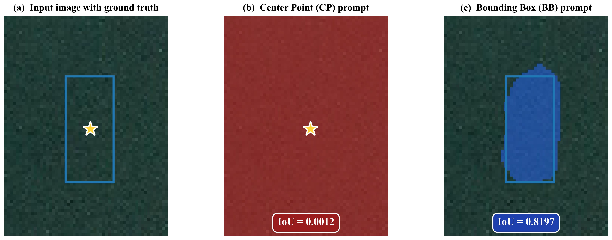
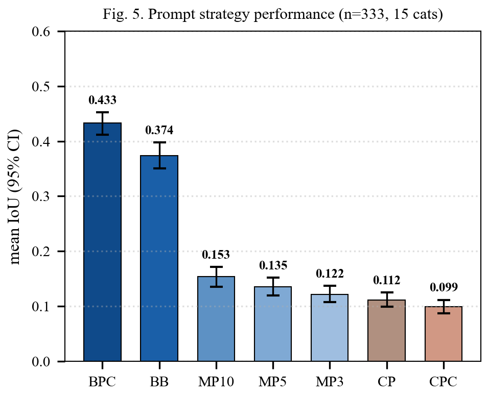
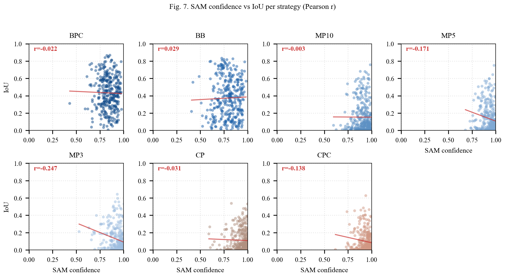

# SAM Prompt Strategy Comparison on iSAID

[](https://opensource.org/licenses/MIT)
[](https://www.python.org/downloads/)
[](https://pytorch.org/)
[](https://github.com/facebookresearch/segment-anything)
[](#citation)

> Code and data release for the paper:
> **"Segment Anything Model for Remote Sensing Instance Segmentation: Systematic Prompt Strategy Evaluation and Bounding Box Superiority on iSAID"**
>
> Mehreen Tarif, Wu Xu, Sana Abbas
> College of Computer Science and Cyber Security, Chengdu University of Technology, China
>
> Submitted to *IEEE Geoscience and Remote Sensing Letters* (GRSL), 2026

---

## ⭐ Primary Scripts (Start Here)

To reproduce the paper's results, use these primary scripts:

| Script | Purpose |
|:-------|:--------|
| **`SAM_FINAL_EXPERIMENT.py`** | 🎯 Main experiment runner (all 7 strategies × 333 instances) |
| **`SAM_ABLATION.py`** | Ablation studies (backbone, resolution, noise) |
| **`statistical_analysis.py`** | Cohen's d, Bonferroni correction, bootstrap CIs |
| **`create_paper_figures.py`** | Generate paper figures (Fig 1, 4, 5) |

> 💡 The repository also contains earlier exploration scripts kept for transparency about the development process. The four primary scripts above are sufficient to reproduce all results in the paper.

---

## 📋 Table of Contents

- [Overview](#-overview)
- [Why Prompt Choice Matters](#-why-prompt-choice-matters)
- [Key Findings](#-key-findings)
- [Results](#-results)
- [Installation](#-installation)
- [Quick Start](#-quick-start)
- [Reproducing Results](#-reproducing-results)
- [Citation](#-citation)
- [Contact](#-contact)

---

## 🎯 Overview

This repository contains the complete experimental framework for evaluating **seven prompt configurations** of the Segment Anything Model (SAM) on the iSAID aerial imagery benchmark. We provide a systematic comparison under a controlled, zero-shot protocol with statistical rigor.

The main finding is that **box-based prompts substantially outperform point-based prompts** for aerial instance segmentation:

| Prompt Type | mIoU | Cohen's d |
|:-----------:|:----:|:---------:|
| Box-plus-Center (BPC) | **0.432** | — |
| Bounding Box (BB) | 0.374 | 0.44 vs BPC |
| Center Point (CP) | 0.111 | 1.49 vs BPC |

---

## 🖼️ Why Prompt Choice Matters

The same SAM ViT-H model on the same iSAID image produces dramatically different results depending on prompt type:

<p align="center">

</p>

**Same model, same image, different prompt — IoU jumps from 0.0012 (centroid) to 0.8197 (bounding box).**

---

## 🔬 Key Findings

1. **BPC outperforms CP by 0.321 mIoU** (Cohen's d = 1.49, p < 0.001 after Bonferroni correction)
2. **Box-versus-point ordering is robust** across:
   - SAM backbone scales (ViT-H and ViT-B)
   - Input resolutions (512, 768, 1024 px)
   - Bounding-box coordinate noise up to ±10 pixels
3. **Zero-shot SAM-BPC achieves 38.7% IoU ≥ 0.5 rate**, placing it within the published mAP@0.5 range of supervised baselines (32.3%–47.3%) without using any iSAID training data
4. **Effect originates in prompt content**, not mask selection (oracle selection only raises CP from 0.111 to 0.169)

---

## 📊 Results

### Strategy Comparison

Mean IoU per prompt strategy on the iSAID evaluation set (n = 333). Box-based strategies (BPC, BB) form a clear performance tier above all five point-based strategies.

<p align="center">

</p>

### Confidence vs IoU Calibration

Self-predicted SAM confidence versus mean IoU for each prompt strategy. Point-based strategies cluster in the high-confidence, low-IoU region, illustrating SAM's calibration gap under sparse prompts.

<p align="center">

</p>

### Per-Strategy Performance Table

Evaluation on 333 iSAID instances across 15 categories, 2,331 SAM inferences, ViT-H at 1024×1024, seed = 42.

| Strategy | mIoU | 95% CI | Precision | Recall | F1 | Time (ms) |
|:---------|:----:|:------:|:---------:|:------:|:--:|:---------:|
| **BPC** | **0.433** | [0.405, 0.461] | 0.751 | 0.552 | 0.598 | 13.17 |
| BB | 0.374 | [0.347, 0.402] | 0.758 | 0.444 | 0.510 | 12.45 |
| MP10 | 0.154 | [0.136, 0.173] | 0.183 | 0.831 | 0.272 | 12.89 |
| MP5 | 0.135 | [0.119, 0.152] | 0.158 | 0.838 | 0.244 | 12.67 |
| MP3 | 0.122 | [0.108, 0.137] | 0.144 | 0.847 | 0.224 | 12.23 |
| CP | 0.112 | [0.098, 0.127] | 0.131 | 0.852 | 0.211 | 31.17 |
| CPC | 0.099 | [0.087, 0.112] | 0.108 | 0.847 | 0.182 | 12.78 |

### Statistical Comparisons

All eight pairwise comparisons reach the Bonferroni-corrected threshold (p < 0.001):

| Comparison | Δ IoU | Cohen's d | Magnitude |
|:----------|:-----:|:---------:|:---------:|
| BPC vs CPC | +0.334 | **1.56** | Very large |
| BPC vs CP | +0.322 | **1.49** | Very large |
| BPC vs MP3 | +0.313 | **1.41** | Very large |
| BPC vs MP10 | +0.283 | **1.15** | Large |
| BB vs CP | +0.259 | **1.09** | Large |
| BB vs MP3 | +0.250 | **1.03** | Large |
| BB vs MP10 | +0.221 | **0.84** | Large |
| BPC vs BB | +0.063 | **0.44** | Small-Medium |

---

## ⚙️ Installation

### Prerequisites

- **Python 3.8+**
- **CUDA-capable GPU** (RTX 3090 used in paper; ViT-H needs ~16 GB VRAM)
- **~20 GB disk space** for the iSAID dataset

### Step 1: Clone the repository

```bash
git clone https://github.com/Mehreen-Tarif/SAM-Prompt-Comparisonfor.git
cd SAM-Prompt-Comparisonfor
```

### Step 2: Install Python dependencies

```bash
pip install -r requirements.txt
```

### Step 3: Download SAM checkpoints

```bash
wget https://dl.fbaipublicfiles.com/segment_anything/sam_vit_h_4b8939.pth
wget https://dl.fbaipublicfiles.com/segment_anything/sam_vit_b_01ec64.pth
```

### Step 4: Download iSAID dataset

Visit the official iSAID page: **https://captain-whu.github.io/iSAID/**

---

## 🚀 Quick Start

To reproduce all results in the paper, run the main experiment script:

```bash
python SAM_FINAL_EXPERIMENT.py
```

This runs all six phases:
- Phase 1: Build experiment plan (333 instances, 15 categories)
- Phase 2: Main experiment (7 strategies × 333 instances)
- Phase 3: Ablation A1 (ViT-H vs ViT-B backbone)
- Phase 4: Ablation A2 (Resolution: 512/768/1024)
- Phase 5: Ablation A3 (Bounding box noise)
- Phase 6: Statistical analysis (Bonferroni, Cohen's d, bootstrap)

**Expected runtime:** 75–90 minutes on RTX 3090.

> 💡 **Note:** The script is resumable. If interrupted, just re-run and it continues from the last checkpoint.

### Generate paper figures

```bash
python create_paper_figures.py
```

---

## 🔄 Reproducing Results

All results in the paper are reproducible with the fixed random seed (42).

| Paper Reference | CSV File |
|:----------------|:---------|
| Table II (Per-Strategy Performance) | `results/Table_II_Overall.csv` |
| Table III (Statistical Comparisons) | `results/Table_III_Stats.csv` |
| Section IV-C, Ablation A1 | `results/Ablation_A1_Backbone.csv` |
| Section IV-C, Ablation A2 | `results/Ablation_A2_Resolution.csv` |
| Section IV-C, Ablation A3 | `results/Ablation_A3_BoxNoise.csv` |

### Sampling Note

The 333 evaluation instances are the **25 largest instances per category**. This choice ensures prompt-mask correspondence is meaningful and visible. Performance on smaller or occluded instances may differ. See the Limitations section of the paper for further discussion.

---

## 📝 Citation

If you use this code or build on this work, please cite our paper:

```bibtex
@article{tarif2026sam,
  title   = {Segment Anything Model for Remote Sensing Instance Segmentation:
             Systematic Prompt Strategy Evaluation and Bounding Box Superiority on iSAID},
  author  = {Tarif, Mehreen and Xu, Wu and Abbas, Sana},
  journal = {IEEE Geoscience and Remote Sensing Letters},
  year    = {2026},
  note    = {Submitted}
}
```

---

## 🙏 Acknowledgments

- **[iSAID benchmark](https://captain-whu.github.io/iSAID/)** by the CAPTAIN laboratory, Wuhan University
- **[Segment Anything Model](https://github.com/facebookresearch/segment-anything)** by Meta AI Research
- **[DOTA dataset](https://captain-whu.github.io/DOTA/)** (which iSAID builds upon)

---

## 📧 Contact

| Role | Name | Email |
|:-----|:-----|:------|
| First Author | Mehreen Tarif | mehreentarif17@gmail.com |
| Corresponding Author | Wu Xu | wuxu2022@cdut.edu.cn |

For questions about the code or paper, please open an [Issue](https://github.com/Mehreen-Tarif/SAM-Prompt-Comparisonfor/issues) or contact the authors directly.

---

## 📜 License

This code is released under the [MIT License](LICENSE) for research and reproducibility purposes.

---

<div align="center">

**⭐ If you find this work useful, please consider starring the repository! ⭐**

Made with ❤️ at Chengdu University of Technology

</div>
