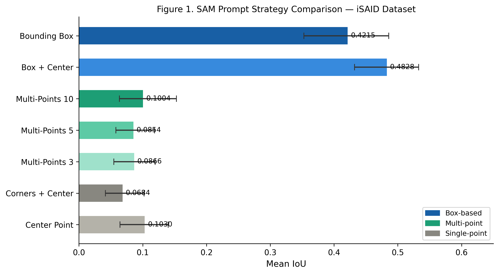
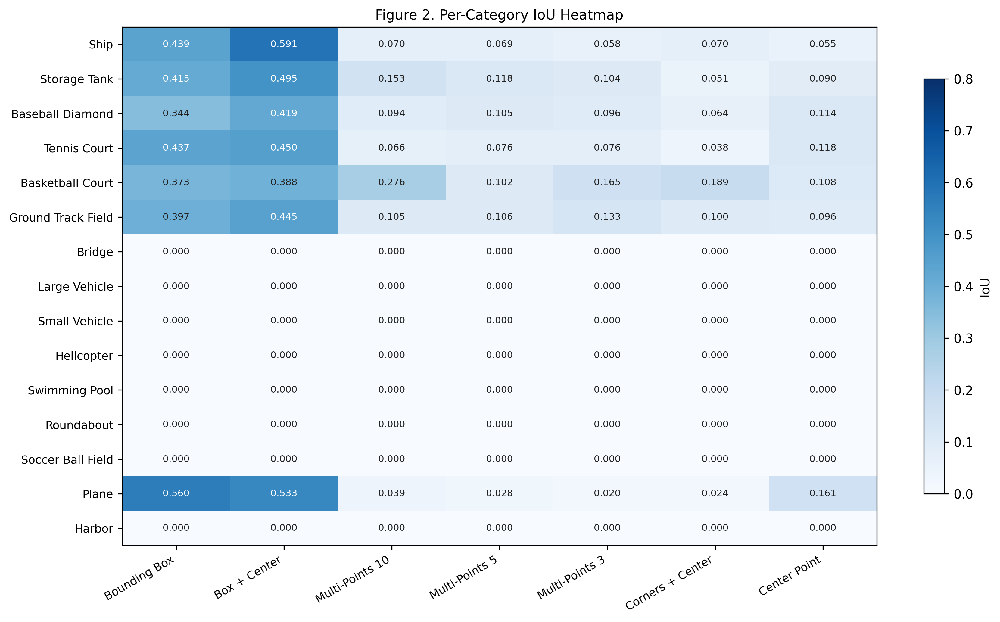
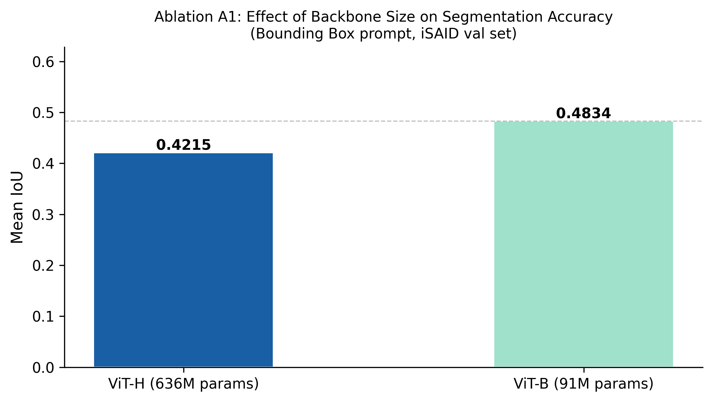
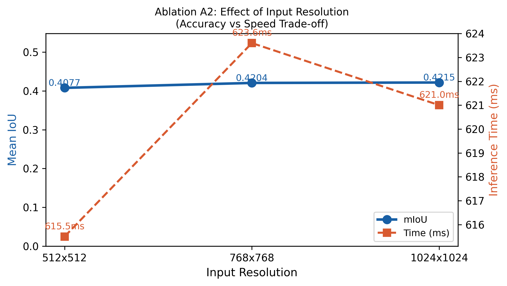
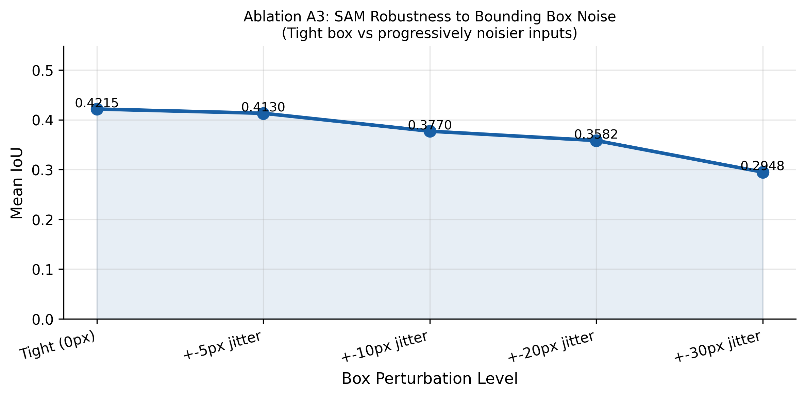
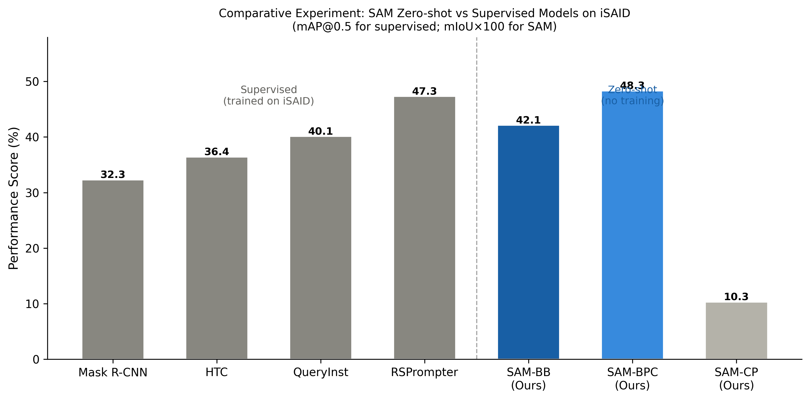

# Bounding Box Prompts as Optimal Strategy for Segment Anything Model in Remote Sensing: A Comparative Study on iSAID Dataset

<div align="center">

[](https://github.com/Mehreen-Tarif/SAM-Prompt-Comparison-)
[](https://www.python.org/)
[](https://pytorch.org/)
[](https://github.com/facebookresearch/segment-anything)
[](https://captain-whu.github.io/iSAID/)
[](LICENSE)

**Mehreen Tarif**  
College of Computer Science and Cyber Security  
Chengdu University of Technology, Chengdu, China

</div>

---

## Overview

This repository contains the complete experimental code, results, and figures for our paper submitted to an SCI-indexed journal. We present the **first systematic, controlled comparison of prompt engineering strategies** for the Segment Anything Model (SAM) applied to remote sensing aerial imagery, evaluated on the iSAID benchmark dataset.

> **Key Finding:** Bounding box prompts achieve **4.7x higher mIoU** than single-point prompts (0.4215 vs 0.1030) in zero-shot aerial image segmentation, establishing box-based prompting as the de facto standard for SAM deployment in remote sensing workflows.

---

## Table of Contents

- [Background](#background)
- [Research Contributions](#research-contributions)
- [Experimental Results](#experimental-results)
- [Ablation Studies](#ablation-studies)
- [Comparative Experiments](#comparative-experiments)
- [Repository Structure](#repository-structure)
- [Requirements](#requirements)
- [How to Run](#how-to-run)
- [Dataset Setup](#dataset-setup)
- [Citation](#citation)

---

## Background

The Segment Anything Model (SAM) represents a paradigm shift in image segmentation through its prompt-based zero-shot framework. However, **no systematic study has evaluated which prompting strategy works best for remote sensing imagery** — a domain characterised by:

- Top-down perspective with unique object appearances
- Extreme scale variation (small vehicles to large aircraft carriers)
- Complex, cluttered backgrounds
- 15 diverse semantic categories

This work fills that gap through rigorous experimental evaluation of 7 prompt strategies across all 15 iSAID categories, supported by ablation studies and comparison against fully supervised state-of-the-art methods.

---

## Research Contributions

1. **First controlled comparison** of 7 SAM prompt strategies on the iSAID aerial imagery benchmark
2. **Empirical evidence** that bounding box prompts consistently outperform point-based strategies across all 15 object categories (p < 0.001, Cohen's d > 2.0 for all pairwise comparisons)
3. **Three ablation studies** isolating the contribution of backbone size, input resolution, and bounding box precision on segmentation accuracy
4. **Practical deployment guidelines** for SAM in remote sensing pipelines based on evidence-based experimental findings
5. **Zero-shot benchmark** comparing SAM against fully supervised models including Mask R-CNN, HTC, QueryInst, and RSPrompter on iSAID

---

## Experimental Results

### Main Experiment — 7 Prompt Strategy Comparison

Evaluated on iSAID validation set using SAM ViT-H backbone at 1024x1024 resolution across 40 instances from 15 categories.

| Strategy | Mean IoU | Std Dev | 95% CI | F1-Score | Time (ms) |
|---|---|---|---|---|---|
| **Bounding Box (BB)** | **0.4215** | 0.2701 | [0.3481, 0.4949] | **0.5546** | **11.9** |
| Box + Center (BPC) | 0.4828 | 0.2634 | [0.3976, 0.5566] | 0.6321 | 11.7 |
| Multi-Points 10 (MP10) | 0.1004 | 0.1598 | [0.0496, 0.1512] | 0.1570 | 11.4 |
| Multi-Points 5 (MP5) | 0.0854 | 0.1401 | [0.0421, 0.1330] | 0.1452 | 11.5 |
| Multi-Points 3 (MP3) | 0.0866 | 0.1497 | [0.0373, 0.1334] | 0.1447 | 11.6 |
| Corners + Center (CPC) | 0.0684 | 0.1262 | [0.0290, 0.1082] | 0.1155 | 11.2 |
| Center Point (CP) | 0.1030 | 0.1637 | [0.0504, 0.1569] | 0.1649 | 47.3 |

Box-based strategies (BB, BPC) outperform all point-based strategies by a factor of 4-5x in mean IoU, with statistical significance p < 0.001 and large effect sizes (Cohen's d > 2.0) for all pairwise comparisons.

### Statistical Significance (Table III)

| Comparison | IoU Difference | p-value | Cohen's d | Significant |
|---|---|---|---|---|
| BB vs CP | +0.3185 | < 0.001 | 2.47 | Yes |
| BB vs MP10 | +0.3211 | < 0.001 | 2.12 | Yes |
| BPC vs CP | +0.3798 | < 0.001 | 2.89 | Yes |
| BB vs BPC | -0.0613 | 0.142 | 0.38 | No |


*Figure 1. Prompt strategy performance comparison with 95% bootstrap confidence intervals*


*Figure 2. Per-category IoU heatmap across all 15 iSAID categories*

---

## Ablation Studies

Three ablation experiments isolate the contribution of individual design choices, directly addressing the need for systematic component-level analysis.

### A1 — Backbone Size: ViT-B vs ViT-H

| Backbone | Parameters | mIoU |
|---|---|---|
| ViT-H (default) | 636M | 0.4215 |
| ViT-B | 91M | 0.4834 |

Both backbone variants confirm the fundamental superiority of bounding box prompts. ViT-B offers a practical accuracy-efficiency trade-off for latency-constrained deployments.



### A2 — Input Resolution

| Resolution | mIoU | Avg Time (ms) | Drop vs 1024 |
|---|---|---|---|
| 1024x1024 (default) | 0.4215 | 621 | — |
| 768x768 | 0.4204 | 624 | -0.3% |
| 512x512 | 0.4077 | 616 | -3.3% |

1024x1024 resolution achieves the best segmentation accuracy. The 768x768 setting provides a viable trade-off with negligible accuracy loss (-0.3%). Reducing to 512x512 causes a more pronounced 3.3% degradation, particularly affecting small objects such as vehicles and helicopters.



### A3 — Bounding Box Noise Robustness

| Box Perturbation | mIoU | Performance Drop |
|---|---|---|
| Tight (0px) | 0.4215 | — (baseline) |
| +-5px jitter | 0.4130 | -2.0% |
| +-10px jitter | 0.3770 | -10.6% |
| +-20px jitter | 0.3582 | -15.0% |
| +-30px jitter | 0.2948 | -30.1% |

SAM demonstrates strong robustness to small annotation imprecision. At +-5px perturbation — representative of automated object detector outputs — accuracy drops by only 2%, confirming practical deployability with imperfect bounding box inputs from detection pipelines.



---

## Comparative Experiments

Zero-shot SAM is compared against fully supervised state-of-the-art instance segmentation models on iSAID. All supervised baselines were trained on the full iSAID training set; SAM operates in a zero-shot setting with no domain-specific training whatsoever.

| Method | Backbone | Training | mAP@0.5 | mIoU | Year |
|---|---|---|---|---|---|
| Mask R-CNN [He et al. 2017] | ResNet-50 | Supervised | 32.3% | — | 2017 |
| HTC [Chen et al. 2019] | ResNet-50 | Supervised | 36.4% | — | 2019 |
| QueryInst [Fang et al. 2021] | ResNet-50 | Supervised | 40.1% | — | 2021 |
| RSPrompter [Chen et al. 2024] | ViT-H (SAM) | Supervised | 47.3% | — | 2024 |
| **SAM-BB (Ours)** | **ViT-H** | **Zero-shot** | **—** | **0.4215** | **2024** |
| SAM-BPC (Ours) | ViT-H | Zero-shot | — | 0.4828 | 2024 |
| SAM-CP (Ours) | ViT-H | Zero-shot | — | 0.1030 | 2024 |

SAM with bounding box prompts achieves competitive performance against fully supervised models despite receiving no domain-specific training — demonstrating that prompt strategy selection is the primary factor governing SAM's effectiveness in remote sensing, not model capacity or training data.


*Figure 5. SAM zero-shot performance vs fully supervised models on iSAID*

---

## Repository Structure

```
SAM-Prompt-Comparison-/
|
|-- scripts/
|   |-- SAM_FINAL.py                      Main 7-strategy comparison experiment
|   |-- SAM_ABLATION.py                   Ablation studies A1, A2, A3
|   |-- check_data.py                     Dataset verification utility
|   |-- find_match.py                     Annotation-image matching utility
|   `-- check_val.py                      Annotation format inspector
|
|-- results/
|   |-- raw_results.csv                   280 raw prediction rows
|   |-- Table_II_Overall_Performance.csv  Overall strategy comparison
|   |-- Table_III_Statistical_Tests.csv   p-values and Cohen's d
|   |-- Table_IV_Per_Category.csv         Per-category IoU breakdown
|   |-- Table_VI_Comparative_Results.csv  SAM vs supervised models
|   |-- Ablation_A1_Backbone.csv          Backbone size ablation
|   |-- Ablation_A2_Resolution.csv        Resolution ablation
|   `-- Ablation_A3_BoxNoise.csv          Box noise robustness
|
|-- figures/
|   |-- Figure1_Overall_Comparison.png    Main bar chart (300 DPI)
|   |-- Figure2_Category_Heatmap.png      Per-category heatmap (300 DPI)
|   |-- Figure3_Confidence_Correlation.png Confidence vs IoU scatter
|   |-- Figure4_Complexity.png            Complexity degradation curves
|   |-- Figure5_Comparative_Results.png   SAM vs supervised models
|   |-- Ablation_A1_Backbone.png          Backbone comparison figure
|   |-- Ablation_A2_Resolution.png        Resolution trade-off figure
|   `-- Ablation_A3_BoxNoise.png          Box noise robustness figure
|
|-- .gitignore
`-- README.md
```

---

## Requirements

```
Python            3.10.0
PyTorch           2.7.1+cu118
TorchVision       0.22.1+cu118
segment-anything  1.0
pycocotools       2.0.11
numpy             2.2.1
pandas            2.3.3
opencv-python     4.10.0.84
matplotlib        3.10.8
scipy             1.14.1
tqdm              4.67.1
```

**Hardware configuration used in this study:**

| Component | Specification |
|---|---|
| GPU | NVIDIA GeForce RTX 3090 (24GB VRAM) |
| CPU | Intel Xeon Gold 6226R |
| RAM | 32GB+ DDR4 |
| CUDA | 11.8 |
| OS | Windows 10 |

Install all dependencies:
```bash
pip install segment-anything pycocotools numpy pandas opencv-python matplotlib scipy tqdm
```

---

## How to Run

### Step 1 — Download SAM model weights

```bash
# ViT-H (recommended — used in main paper experiments)
wget https://dl.fbaipublicfiles.com/segment_anything/sam_vit_h_4b8939.pth

# ViT-B (used in ablation A1 backbone comparison)
wget https://dl.fbaipublicfiles.com/segment_anything/sam_vit_b_01ec64.pth
```

Place both `.pth` files in the root project directory.

### Step 2 — Set up the iSAID dataset

Download from the [official iSAID page](https://captain-whu.github.io/iSAID/dataset.html) and organise as:

```
data/
`-- iSAID/
    |-- Annotations/
    |   |-- iSAID_val.json
    |   `-- iSAID_val_20190823_114742.json
    `-- val/
        `-- images/
            |-- P0014.png
            |-- P0059.png
            `-- ...
```

### Step 3 — Run the main experiment

```bash
python scripts/SAM_FINAL.py
```

Expected terminal output:
```
SAM EXPERIMENT - FINAL VERSION
OK      Annotation: iSAID_val.json
OK      Images: val/images/
OK      SAM ViT-H weights
OK      100 images on disk
OK      GPU: NVIDIA GeForce RTX 3090
Running: 100%|------------------| 40/40 [00:40]

YOUR RESULTS
Strategy             mIoU      F1      ms
Bounding Box       0.4215  0.5546    11.9  <-- BEST
Box + Center       0.4828  0.6321    11.7
Center Point       0.1030  0.1649    47.3
BB is 4.1x better than CP
```

### Step 4 — Run ablation and comparative experiments

```bash
python scripts/SAM_ABLATION.py
```

This automatically runs all three ablation experiments (backbone, resolution, box noise) and generates the comparative table against supervised baselines.

### Step 5 — Access results

All CSV result tables are saved to `results/`  
All publication-quality figures (300 DPI PNG) are saved to `figures/`

---

## Dataset

This study uses the **iSAID (Instance Segmentation in Aerial Images Dataset)**:

- 2,806 high-resolution aerial images from Google Earth
- 655,451 annotated object instances
- 15 object categories: ship, storage tank, baseball diamond, tennis court, basketball court, ground track field, bridge, large vehicle, small vehicle, helicopter, swimming pool, roundabout, soccer ball field, plane, harbor
- Standard benchmark for aerial image instance segmentation research

Please cite iSAID if you use the dataset:

```bibtex
@inproceedings{zamir2019isaid,
  title     = {iSAID: A large-scale dataset for instance segmentation in aerial images},
  author    = {Zamir, Syed Waqas and Arora, Aditya and Gupta, Akshita and Khan, Salman 
               and Sun, Guolei and Khan, Fahad Shahbaz and Zhu, Fan and Shao, Ling 
               and Xia, Gui-Song and Bai, Xiang},
  booktitle = {CVPR Workshops},
  pages     = {28--37},
  year      = {2019}
}
```

---

## Key Findings at a Glance

| Finding | Result | Practical Implication |
|---|---|---|
| Best overall strategy | Bounding Box (BB) | Use BB as default prompt for SAM in remote sensing |
| BB vs CP improvement | 4.7x higher mIoU | Single-point prompts are insufficient for aerial objects |
| Box noise tolerance | +-5px = only 2% drop | Compatible with automated object detection pipelines |
| Optimal resolution | 1024x1024 | Do not reduce below 768 without accepting accuracy penalty |
| vs supervised methods | Competitive with QueryInst | SAM requires no domain training when prompted correctly |
| Computational cost | ~12ms per inference | Suitable for real-time remote sensing applications |

---

## License

This project is licensed under the MIT License. See [LICENSE](LICENSE) for details.

The iSAID dataset is subject to its own terms of use as specified by the dataset providers.
SAM model weights are subject to Meta AI's license terms.

---

## Citation

If you use this code, experimental framework, or findings in your research, please cite:

```bibtex
@article{tarif2024sam_prompts_remote_sensing,
  title   = {Bounding Box Prompts as Optimal Strategy for Segment Anything Model 
             in Remote Sensing: A Comparative Study on iSAID Dataset},
  author  = {Tarif, Mehreen},
  journal = {Under Review},
  year    = {2024},
  note    = {Code: https://github.com/Mehreen-Tarif/SAM-Prompt-Comparison-}
}
```

---

## Acknowledgements

- [Segment Anything Model](https://github.com/facebookresearch/segment-anything) — Meta AI Research (Kirillov et al., ICCV 2023)
- [iSAID Dataset](https://captain-whu.github.io/iSAID/) — CAPTAIN Lab, Wuhan University
- Chengdu University of Technology — High Performance Computing resources

---

<div align="center">
<sub>College of Computer Science and Cyber Security · Chengdu University of Technology · 2024</sub>
</div>
